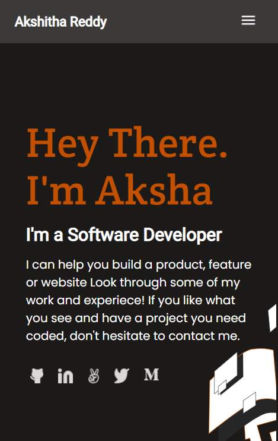
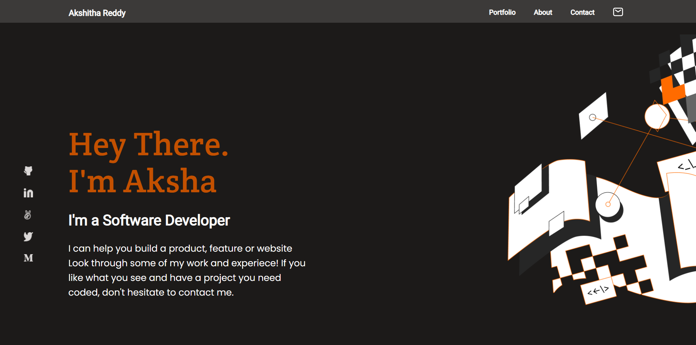

# Microverse-Portfolio-Project

## Portfolio website to showcase my education, qualifications, skills, training, experiences, projects, resume.

# Built With
HTML

CSS

JavaScript

# Additional tools

Figma

FormSpree

Github pages

Google Analytics

# Demo link

### [Aksha Portfolio](https://akshithareddy1899.github.io/Microverse-Portfolio/)

# Author
👤 Akshitha Reddy

GitHub: https://github.com/AkshithaReddy1899

Portfolio: https://akshithareddy1899.github.io/Portfolio/

LinkedIn: https://www.linkedin.com/in/akshitha-reddy-716944198/

🤝 Contributing
Contributions, issues, and feature requests are welcome!

Feel free to check the issues page.

Show your support
Give a ⭐️ if you like this project!

# Acknowledgments

Microverse

# 📝 License
This project is MIT licensed.
